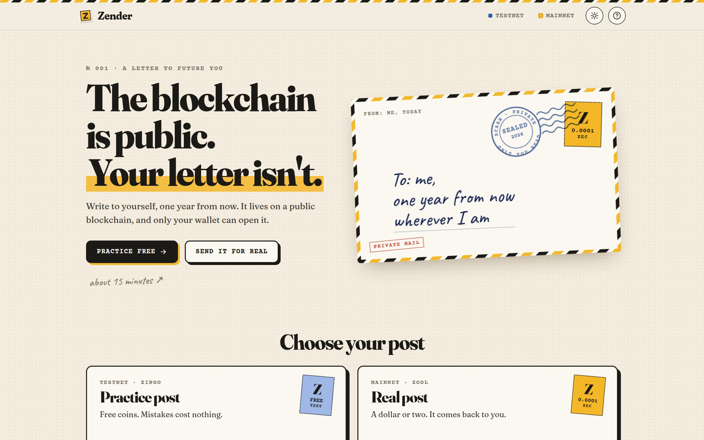
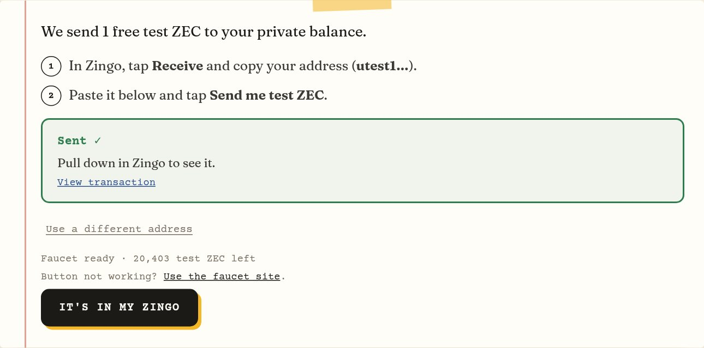
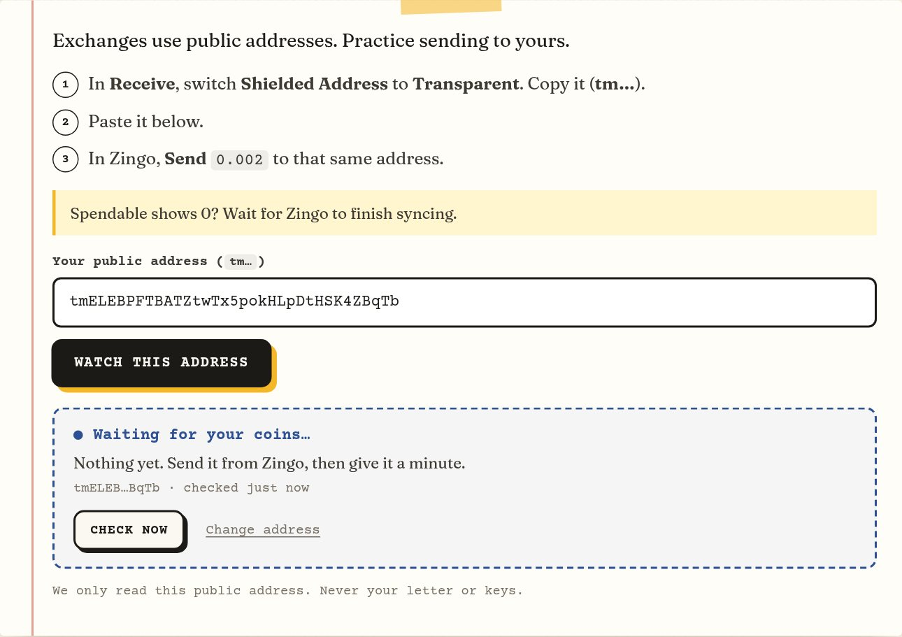
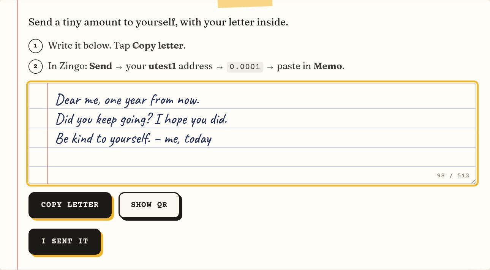
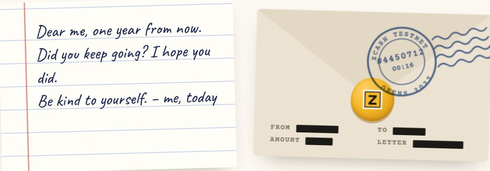
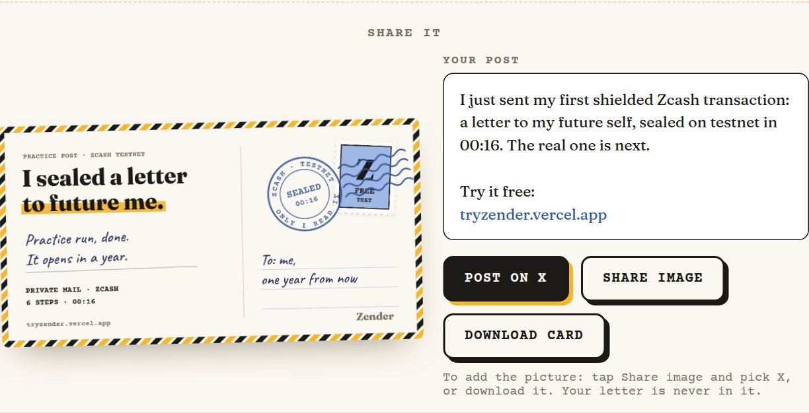
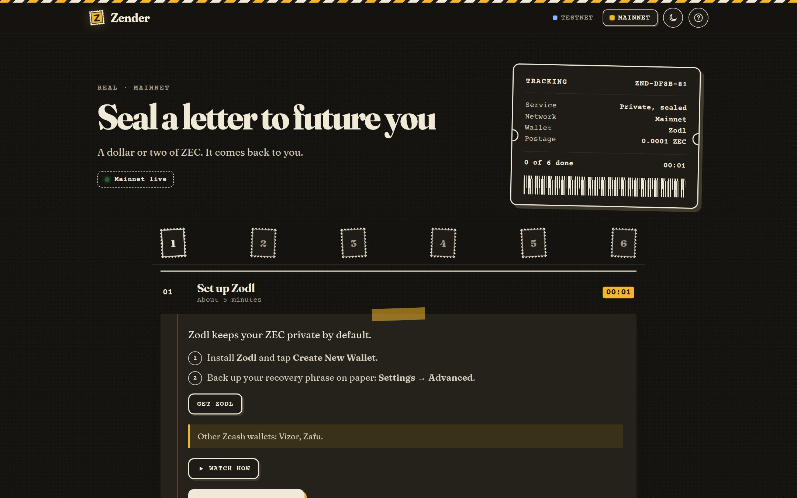

<div align="center">


# Zender

### A letter to your future self, sealed on Zcash.

**The blockchain is public. Your letter isn't.**

[](https://tryzender.vercel.app)
[](https://z.cash)
[](#privacy)
[](LICENSE)

[**Try it**](https://tryzender.vercel.app) &nbsp;·&nbsp; [Practice round](https://tryzender.vercel.app/testnet) &nbsp;·&nbsp; [Real round](https://tryzender.vercel.app/mainnet)

<br>

<picture>
  <source media="(prefers-color-scheme: dark)" srcset=".github/readme/home-dark.jpg">
  
</picture>

</div>

<br>

## Why Zender

Most people meet Zcash the same way: they buy some on an exchange, leave it on a transparent address, and never use the part that makes Zcash different. Shielded sends sound technical, so nobody tries one.

Zender gives you a reason to. You write a letter to your future self and seal it inside a shielded transaction that you send to yourself. It sits on a public blockchain, and only your wallet can open it. A year from now, you read it again.

To get there, Zender takes you from no wallet at all to your first private send, one step at a time, and checks your progress on the real chain as you go.

<br>

## Two rounds, six steps each

|  | 🧪 **Practice** | ✉️ **Real** |
| :-- | :-- | :-- |
| **Where** | [`/testnet`](https://tryzender.vercel.app/testnet) | [`/mainnet`](https://tryzender.vercel.app/mainnet) |
| **Wallet** | [Zingo](https://zingolabs.org/zingo/download/) on testnet | [Zodl](https://zodl.com/) |
| **Coins** | Free, from the built-in faucet | A dollar or two of ZEC |
| **You end with** | A practice letter, sealed | A real letter that opens in a year |

### 🧪 Practice round · testnet

| Step | What you do | How it's checked |
| :-: | :-- | :-- |
| **1** | Install Zingo and switch it to testnet, guided by real wallet screenshots | You confirm |
| **2** | Paste your private `utest1` address and tap **Send me test ZEC** | The faucet send is tracked to the transaction |
| **3** | Send `0.002` to your public `tm` address | 🟢 Watched on chain |
| **4** | Tap **Shield** to move it back to private | 🟢 Watched on chain |
| **5** | Write your letter, copy it, and send `0.0001` to yourself with it in the memo | You confirm |
| **6** | Open the transaction in Zingo and read your letter | You confirm |

### ✉️ Real round · mainnet

| Step | What you do | How it's checked |
| :-: | :-- | :-- |
| **1** | Install Zodl and back up your recovery phrase | You confirm |
| **2** | Buy a little ZEC on an exchange and withdraw it to your public `t1` address (or use Swap in Zodl) | 🟢 Watched on chain |
| **3** | Tap **Shield** on your Unshielded Balance | 🟢 Watched on chain |
| **4** | Seal your letter: send `0.0001` to yourself with it in the **Message** field | You confirm |
| **5** | Open the transaction in **Activity** and read your letter | You confirm |
| **6** | Unshield `0.0005` back to your `t1` address, the way exchanges need it | 🟢 Watched on chain |

Every mainnet step has a short clip of the real Zodl screens.

> [!TIP]
> Watched steps turn green by themselves. Zender checks the public address you pasted about every 20 seconds, and a new Zcash block arrives about every 75 seconds.

<br>

## A look inside

<table>
  <tr>
    <td width="50%" valign="top">
      
      <p><b>Free test coins in one tap.</b> Paste your private address and the faucet sends 1 test ZEC, with a link to the transaction.</p>
    </td>
    <td width="50%" valign="top">
      
      <p><b>Watched for you.</b> Paste your public address once. The step turns green by itself when your coins land.</p>
    </td>
  </tr>
  <tr>
    <td width="50%" valign="top">
      
      <p><b>Write your letter.</b> Up to 512 characters. Copy it, then paste it into your wallet's memo when you send to yourself.</p>
    </td>
    <td width="50%" valign="top">
      
      <p><b>Sealed.</b> Your letter goes into an envelope that says when it opens. On mainnet, you can save a reminder for next year.</p>
    </td>
  </tr>
  <tr>
    <td width="50%" valign="top">
      
      <p><b>Share the postcard.</b> Post on X with a postcard drawn on your device. Never your letter, never your address.</p>
    </td>
    <td width="50%" valign="top">
      
      <p><b>Light and dark.</b> The whole site follows your system setting, or switch it with one tap.</p>
    </td>
  </tr>
</table>

<br>

## Privacy

> [!IMPORTANT]
> Zender never asks for a seed phrase, spending key or viewing key. There is no field for one. Your wallet does every send.

- **Your letter never leaves the page.** No network request carries it, and it isn't saved, shared or put in the reminder.
- **Zender only reads one thing:** the public address you paste (`t1` or `tm`). It looks up that address's balance and transaction count and stores nothing.
- **The faucet** (testnet only) receives your `utest1` address so it can send you test coins. It's kept in page memory only.
- **No analytics, no trackers, no cookies.** The page only talks to its own domain. Fonts and media are self-hosted.
- **Saved on your device only:** which steps you've finished, their times, your public address and your theme. **Start over** clears a round.
- **The share postcard** shows the network and your time. Never a block number, an address or your letter.

<br>

## How the letter works

A Zcash shielded transaction can carry an encrypted memo of up to 512 bytes. Only the wallet that receives the transaction can decrypt it. Zender uses that memo as your letter.

1. Write the letter on the page and tap **Copy letter**.
2. In your wallet, send `0.0001` to your own private address and paste the letter into the memo (**Memo** in Zingo, **Message** in Zodl).
3. The letter is now on the blockchain, encrypted. Anyone can see that a transaction happened. No one but you can read what's inside.

If you'd rather scan than paste, **Show QR** builds a standard [ZIP 321](https://zips.z.cash/zip-0321) payment request to your own unified address with the letter already in the memo.

<br>

## Under the hood

- **Plain HTML, CSS and JavaScript.** No framework and no build step.
- **Chain checks:** a small serverless function asks a Zcash light server ([lightwalletd](https://github.com/zcash/lightwalletd), over gRPC) for one public address's balance and transaction count.
- **Faucet:** a serverless function passes your claim to the [fauzec](https://fauzec.com) testnet faucet and tracks it to the transaction.
- **Locked down:** a strict Content Security Policy, same-origin checks on every API call, and no third-party code at runtime.
- **Hosted on Vercel.**

<br>

## Run it locally

```bash
git clone https://github.com/Datwebguy/Zender.git
cd Zender
npm install
npx vercel dev     # site and API on http://localhost:3000
```

Run the tests:

```bash
npm test
```

<br>

## License

[MIT](LICENSE) © Datwebguy

<div align="center">
<br>
<sub>Not affiliated with any wallet, exchange or Zcash organisation.</sub>
</div>
